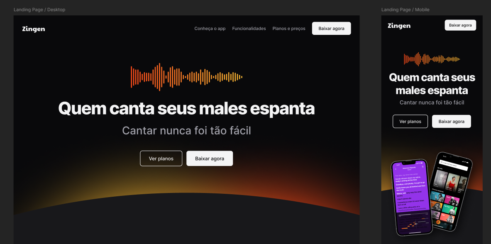

## Demonstração Desktop


## Demonstração Mobile


Zingen é uma aplicação web interativa que permite aos usuários aprimorar suas habilidades vocais através de ferramentas de karaokê e análise de performance.

## 🎯 Funcionalidades

- **Remoção de Voz Original**: Transforme músicas em versões de karaokê removendo a voz original.
- **Avaliação de Performance**: Compare sua voz com a música original para avaliar sua afinação.
- **Gravação de Performances**: Grave suas performances em áudio e vídeo.
- **Compartilhamento com a Comunidade**: Compartilhe suas gravações e interaja com outros usuários.
- **Letras em Tempo Real**: Visualize as letras das músicas sincronizadas em tempo real.

## 🛠 Tecnologias Utilizadas

- **HTML5**
- **CSS3**

## 📂 Estrutura do Projeto

- **index.html**: Arquivo principal contendo a estrutura da página.
- **styles/**: Diretório contendo os arquivos CSS para estilização.
- **assets/**: Pasta com imagens, ícones e outros recursos multimídia.

## 🚀 Como Executar o Projeto

1. Clone o repositório:
   ```bash
   git clone https://github.com/rakanelli/zingen.git
   ```
2. Navegue até o diretório do projeto:
   ```bash
   cd zingen
   ```
3. Abra o arquivo `index.html` em seu navegador preferido.

## 🤝 Contribuição

Contribuições são bem-vindas! Sinta-se à vontade para abrir issues ou enviar pull requests para melhorias no projeto.
---